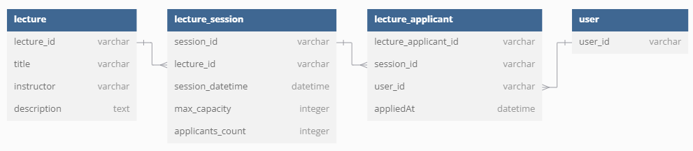
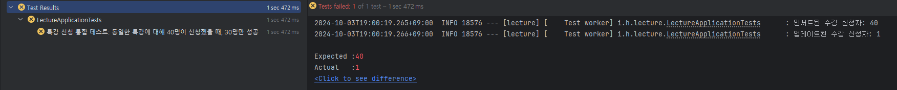
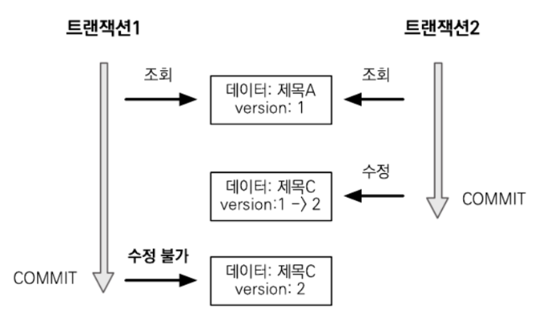
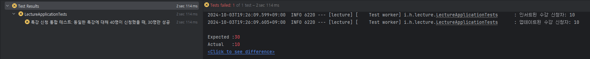
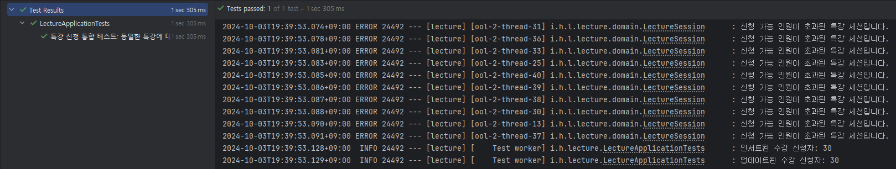

## 항해 플러스 2주차. 특강 신청 서비스

## 요구사항
___
```
💡 아래 명세를 잘 읽어보고, 서버를 구현합니다.

📌 Description

- `특강 신청 서비스`를 구현해 봅니다.
- 항해 플러스 토요일 특강을 신청할 수 있는 서비스를 개발합니다.
- 특강 신청 및 신청자 목록 관리를 RDBMS를 이용해 관리할 방법을 고민합니다.

📌 Requirements

- 아래 2가지 API 를 구현합니다.
   - 특강 신청 API
   - 특강 신청 여부 조회 API
- 각 기능 및 제약 사항에 대해 단위 테스트를 반드시 하나 이상 작성하도록 합니다.
- 다수의 인스턴스로 어플리케이션이 동작하더라도 기능에 문제가 없도록 작성하도록 합니다.
- 동시성 이슈를 고려하여 구현합니다.

📌 API Specs

1️⃣(핵심) 특강 신청 API

- 특정 userId 로 선착순으로 제공되는 특강을 신청하는 API 를 작성합니다.
- 동일한 신청자는 동일한 강의에 대해서 한 번의 수강 신청만 성공할 수 있습니다.
- 특강은 선착순 30명만 신청 가능합니다.
- 이미 신청자가 30명이 초과되면 이후 신청자는 요청을 실패합니다.

2️⃣특강 선택 API 

- 날짜별로 현재 신청 가능한 특강 목록을 조회하는 API 를 작성합니다.
- 특강의 정원은 30명으로 고정이며, 사용자는 각 특강에 신청하기전 목록을 조회해볼 수 있어야 합니다.

3️⃣특강 신청 완료 목록 조회 API

- 특정 userId 로 신청 완료된 특강 목록을 조회하는 API 를 작성합니다.
- 각 항목은 특강 ID 및 이름, 강연자 정보를 담고 있어야 합니다.

💡 KEY POINT

- 정확하게 30 명의 사용자에게만 특강을 제공할 방법을 고민해 봅니다.
- 같은 사용자에게 여러 번의 특강 슬롯이 제공되지 않도록 제한할 방법을 고민해 봅니다.

Default

- 아키텍처 준수를 위한 애플리케이션 패키지 설계
- 특강 도메인 테이블 설계 및 목록/신청 등 기본 기능 구현
- 각 기능에 대한 단위 테스트 작성

STEP 3

- 설계한 테이블에 대한 ERD 및 이유를 설명하는 README 작성
- 선착순 30명 이후의 신청자의 경우 실패하도록 개선
- 동시에 동일한 특강에 대해 40명이 신청했을 때, 30명만 성공하는 것을 검증하는 통합 테스트 작성

STEP 4

- 같은 사용자가 동일한 특강에 대해 신청 성공하지 못하도록 개선
- 동일한 유저 정보로 같은 특강을 5번 신청했을 때, 1번만 성공하는 것을 검증하는 통합 테스트 작성
```

## ERD
___


### `lecture`
- 특강의 기본 정보를 저장하는 테이블이다.
- `lecture_id(특강 ID)`를 기본키로 가지며, `title(제목)` `instructor(강사)` `description(설명)`에 대한 정보를 저장한다.

### `lecture_session`
- 특정 특강의 세선 정보를 저장하는 테이블이다.
- 하나의 특강이 여러 세션을 가질 수 있도록 설계하였다.
- `session_id(세션 ID)`를 기본키로 가지며 어떤 특강에 속한 세션인지 확인할 수 있는 `lecture_id(특강 ID)`를 외래키로 갖는다.
- `session_datetime(세션 일시)` `max_capacity(최대 수강 인원)` `applicants_count(현재 수강 인원)`에 대한 정보를 저장한다.

### `lecture_applicant`
- 특정 특강 세션에 신청한 사용자의 정보를 저장하는 테이블이다.
- `lecture_applicant_id(수강 신청 ID)`를 기본키로 가진다.
- 어떤 특강의 세션을 신청했는지 확인할 수 있는 `session_id(세션 ID)`와 어떤 사용자가 신청했는지 확인할 수 있는 `user_id(사용자 ID)` 를 외래키로 갖는다.
- `appliedAt(수강 신청 일시)`에 대한 정보를 저장한다.

### `user`
- 사용자의 정보를 저장하는 테이블이다.

## 동시성 제어 및 테스트
___
## 01. 데이터베이스를 활용한 동시성 제어

동시성 처리에는 여러 방법이 있있지만, 데이터베이스를 활용한 동시성 제어 방법 중 대표적인 두가지 방법은 `낙관적락`과 `비관적락`이 있다.

`Step3`와 `Step4`에서 발생하는 동시성 문제를 `낙관적락`과 `비관적락` 으로 해결해보고자 한다.

### `Step3`: 동시에 동일한 특강에 대해 40명이 신청했을 때, 30명만 성공하는 CASE

`특강 신청`은 아래와 같이 동작한다.
1. 특강 세션 정보를 조회한다.
2. 최대 수강 인원보다 현재 수강 인원이 더 적은 경우, 현재 수강 인원을 업데이트한다.
3. 특강 신청자 테이블에 신청자 정보를 저장한다.

동시에 `특강 신청`에 대한 요청이 발생할 경우를 가정하여 아래와 같은 테스트 코드를 작성하였다.

```java
@Test
@DisplayName("특강 신청 통합 테스트: 동일한 특강에 대해 40명이 신청했을 때, 30명만 성공")
void applyForLecture_maxCapacity() throws InterruptedException {

    // Given
    String sessionId = "S001";

    int maxCapacity = 30;
    int applicantsCount = 40;

    ExecutorService executorService = Executors.newFixedThreadPool(applicantsCount);
    CountDownLatch latch = new CountDownLatch(applicantsCount);

    // When
    for(int i = 0; i < applicantsCount; i++) {
        LectureDto.LectureApplyRequest request = new LectureDto.LectureApplyRequest("U00" + (i + 1), sessionId);
        executorService.submit(() -> {
            try {
                lectureService.applyForLecture(request);
            } finally {
                latch.countDown();
            }
        });
    }

    latch.await();
    executorService.shutdown();

    // Then
    LectureSession session = lectureRepository.findLectureSession(sessionId).orElseThrow();
    List<LectureApplicant> lectureApplicants = lectureRepository.findLectureApplicantListBySessionId(sessionId);

    assertEquals(lectureApplicants.size(), session.getApplicantsCount());
    assertEquals(maxCapacity, lectureApplicants.size());
}
```
> `given` 특강 세션 `S001`의 최대 수강 인원은 `30`명인 세션이 있다.
>
> `when` 사용자 `40`명이 동시에 `S001`을 신청한다.
>
> `then` 특강 신청자 테이블의 신청자 수와 특강 세션 테이블의 현재 수강 인원이 같아야 하며, 이는 최대 수강 인원가 같거나 작아야 한다.

동시성 제어 없이 위의 테스트를 실행하면, 아래와 같은 결과가 발생한다.



특강 신청자 테이블에 저장된 특강 신청자 수는 `40`명, 특강 세션 정보의 최대 수강 인원은 `1`명으로 서로 상이한 것을 확인할 수 있다.

동시성 문제로 인해 특강 세션 정보 조회시 현재 수강 인원에 대한 무결성이 깨져 최대 수강 인원에 대한 유효성 처리가 제대로 작동하지 않은 것으로 보인다.

### `낙관적락`을 활용한 동시성 제어

`낙관적락`은 DB의 `Lock`을 사용하지 않고 버전 관리를 통해 동시성 처리를 하는 방법이다.

대부분의 트랜잭션이 충돌하지 않는다고 가정하는 방법으로 트래픽이 상대적으로 적은 요청에 대해 사용하면 좋을 것으로 보인다.

`JPA`가 제공하는 버전 관리 기능을 통해 `낙관적락`을 구현하였다.

최초 요청만 반영되며 나머지 요청은 `ObjectOptimisticLockingFailureException` 예외를 발생시킨다.

```java
@Entity
@Table(name = "lecture_session")
public class LectureSession {

    @Id
    @Column(name = "session_id")
    private String sessionId;

    @Column(name = "lecture_id", insertable = false, updatable = false)
    private String lectureId;

    @Column(name = "session_datetime")
    private LocalDateTime sessionDatetime;

    @Column(name = "max_capacity")
    private int maxCapacity;

    @Column(name = "applicants_count")
    private int applicantsCount;
    
    @Version
    private long version;
}
```
위 코드 처럼 `@Version`을 추가하면, 엔티티를 수정할 때 마다 버전이 하나씩 자동으로 증가하며 아래 그림과 같이 동작한다.


```java
@Lock(LockModeType.OPTIMISTIC)
Optional<LectureSession> findLectureSessionBySessionId(String sessionId);
```
`@Lock(LockModeType.OPTIMISTIC)`을 틍해 특강 세션 정보를 조회하는 쿼리에 `낙관적락`을 적용한다.

`낙관적락`을 적용한 후 테스트 결과는 아래와 같다.



특강 신청자 테이블에 저장된 특강 신청자 수와 특강 세션 정보의 최대 수강 인원이 서로 같은 것을 확인할 수 있다.

특강 신청자 수가 최대 수강 인원 보다 적은 것 역시 확인할 수 있다.

### `비관적락`을 활용한 동시성 제어

`비관적락`은 `낙관적락`과 달리 DB의 `Lock`을 사용한다.

`비관적 락`으로 데이터 조회하면, 해당 트랜잭션이 끝나기 전까지는 데이터를 변경 할 수 없게 된다.

성능 저하 및 데드락 발생 가능성이 있지만, 데이터 일관성을 지키기에 적절한 수단으로 보인다. 

```java
@Lock(LockModeType.PESSIMISTIC_READ)
@Query("select ls from LectureSession ls where ls.sessionId = :sessionId")
Optional<LectureSession> findLectureSessionBySessionId(String sessionId);
```
`@Lock(LockModeType.PESSIMISTIC_READ)`을 틍해 특강 세션 정보를 조회하는 쿼리에 `비관적락`을 적용한다.

`비관적락`을 적용한 후 테스트 결과는 아래와 같다.



완벽하게 동시성 처리가 되었다.